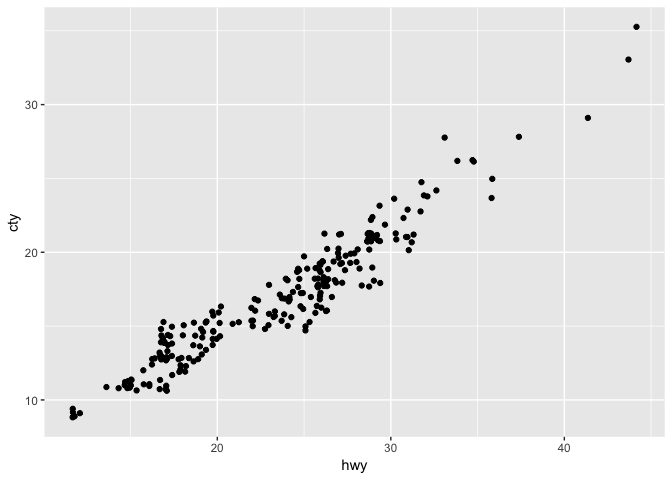

Working Directories for Python in RStudio (Success)
================
Chris Prener
(October 17, 2018)

## Introduction

This notebook illustrates one challenge of integrating Python into our
lab’s existing RStudio workflows - we typically place notebooks in a
`docs/` folder within the main repo. All data is stored in a `data/`
folder.

This creates a challenge for managing the Python side of the notebook,
because the working directory defaults to the same directory the
notebook is stored in. In `R`, we would use the `here::here()` function
to overcome this. Instead, we set the `root.dir` option for `knitr`.

## Dependencies

This notebook requires the `reticulate` package as well a number of
other packages (`ggplot2` and `magrittr`) for illustration purposes.

``` r
# tidyverse packages
library(ggplot2)          # plotting
library(magrittr)         # pipe operator

# other packages
library(reticulate)       # python integration
```

This notebook also requires a couple of Python libraries as well - `os`
for interacting with the operating system and `pandas` for illustration
purposes.

``` python
import os
import pandas as pd
```

## Check Working Directory

Quickly, we’ll check the Python working directory:

``` python
print(os.getcwd())
```

    ## /Users/chris/Desktop/pythonR/docs

Note that this pointing to the project folder instead of the `docs/`
folder. This is the expected behavior now that we have modified the
`setup` chunk above.

## Load Data

This notebook requires data stored in `data/`, which we’ll initial load
into a data frame using `pandas` first:

``` python
cars = pd.read_csv("../data/mpg.csv")
```

## Plot Data

We’ll now plot the `cars` data from the `pandas` data frame:

``` r
py$cars %>%
  ggplot(mapping = aes(hwy, cty)) +
  geom_point(position = "jitter")
```

<!-- -->
